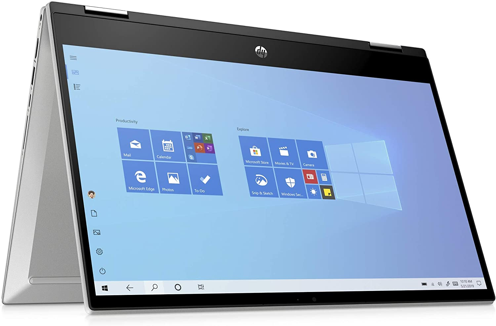

# HP X360 Pavilion 14-dw0004nl

EFI for HP X360 Pavilion 14-dw0004nl Ice Lake with OpenCore bootloader

### Computer Spec:

| Component        | Brank                              |
| ---------------- | ---------------------------------- |
| CPU              | Intel i5 10635G1 (4C-8T 8MB ICL)   |
| iGPU             | Intel® UHD630          			|
| Lan              | NO-LAN                       		|
| Audio            | Realtek ALC287                     |
| Ram              | 1x8GB DDR4 3200 Mhz SODIMM			|
| Wifi + Bluetooth | RTL8822CE 802.11ac PciE		    |
| NVMe             | HYNIX SK PM401 256GB  	   	 	    |
| SmBios           | MacBookPro 16,2                    |
| BootLoader       | OpenCore  0.6.4                    |

### What works and What doesn't or WIP:

- [x] Intel UHD630 iGPU eDP with Backlight Output
- [ ] Intel UHD630 iGPU HDMI Output (Not supported at the moment)
- [ ] Intel UHD630 iGPU Type-C to HDMI Output (Not supported at the moment)
- [ ] ALC287 Internal Speakers
- [ ] ALC287 Internal microphone
- [ ] ALC287 Combojack headphones
- [ ] ALC287 Combojack microphone
- [ ] ALC287 HDMI Audio Output (Not supported at the moment)
- [ ] ALC287 TYPE-C to HDMI Audio Output (Not supported at the moment)
- [x] All USB-A 3.1 Ports (TYPE-C 3.2 Included)
- [x] SpeedStep / Sleep / Wake
- [x] HID Key PWRB & SLPB
- [x] I2C Touchscreen
- [x] I2C Touchpad with gesture (Partial work)
- [x] Keyboard with backlight
- [x] Brightness Key
- [ ] Wi-Fi and Bluetooth Native (to change w/ BCM943602BAED DW1830)
- [x] SSD NVME Slot-1 PCIe Gen3x4
- [x] Micro SD Card Reader (PCIe RTS522A)
- [x] WebCam (USB-Internal)
- [x] ACPI Battery
- [x] NVRAM (Native)

## Peripherals & Benchmarks

### Special Config:

- Usb port mapping performed
- SSDT-Hack Essential patch
- Applied cosmetics PCI Dev

See [ioreg](./IOREG%20MacbookPro16,2.ioreg) for more clarification

## Bios settings for Bios Version F.21
### Enable :
* Fastboot : Enable

### Disable : 
* Secure Boot
* TPM2.0 Security On
* Intel SGX
* VT for Direct I/O
* CFG-lock and DVMT: DO AT YOUR OWN RISK!!! It may brick your laptop.

 
 
 
Create a usb in FAT with MBR map and put [ru.efi](./TOOLS%20EFI%20MOD/RU.efi) in it 
then go to the bios, and create an entry with the path of the usb and setting the ru.efi file and the name of 
your choice startup and then send and finally click apply.

Restart and press f12 among the entries you will have the last created, click any key, then click alt + ì a menu will appear and
scroll to CpuSetup and click enter, in the new screen go with the arrows on the value 0043 and change it from 01 to 00 and click 
enter and then ctrl + w to save and then alt + q to exit. proceed to check if your CFG LOCK is unlocked.

For the 2 DVMT values you have to go to the SaSetup menu and enter and look for 00A4 and set it from 02 to 05 and then move 
next to 00A5 and set from 02 to 03 then save with ctrl + w and to exit alt + q and you will have the suitable DVMT values to the igpu ice lake. 

## Credits

- [Apple](https://apple.com) for macOS.
- [Acidanthera](https://github.com/acidanthera) for OpenCore and all the lovely hackintosh work.
- [Dortania](https://dortania.github.io/OpenCore-Install-Guide/config-laptop.plist/icelake.html) For great and detailed guides.
- [Hackintoshlifeit](https://github.com/Hackintoshlifeit) Support group for installation and post installation.
- [Lorys89](https://github.com/Lorys89) a special thanks for everything about hackintosh! 

# If you need help please contact us on [Telegram](https://t.me/HackintoshLife_it) or [Web](https://www.hackintoshlife.it/)
